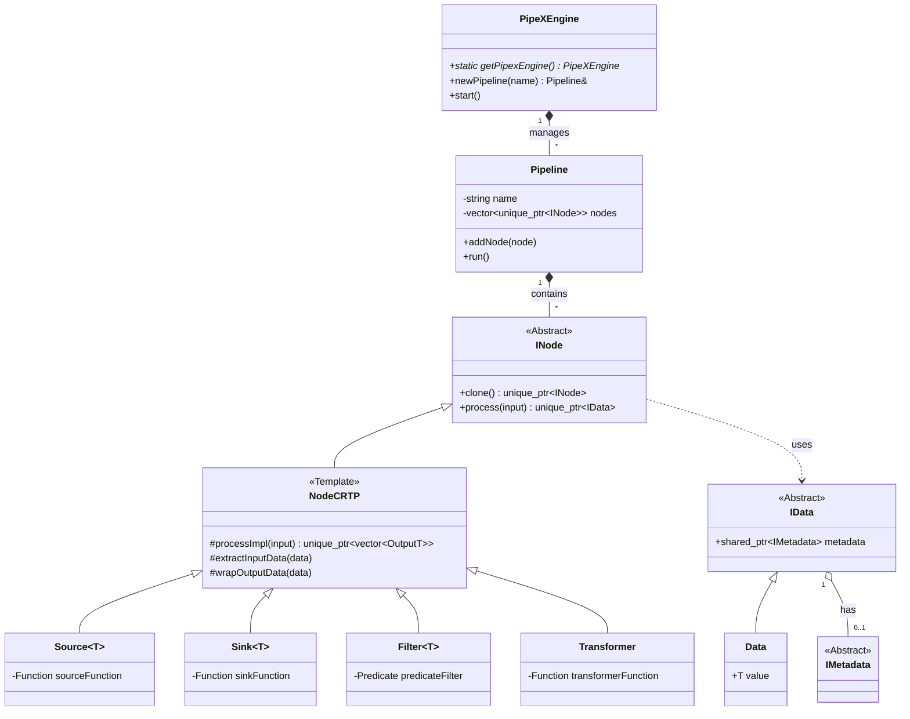
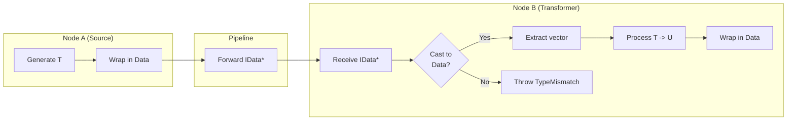
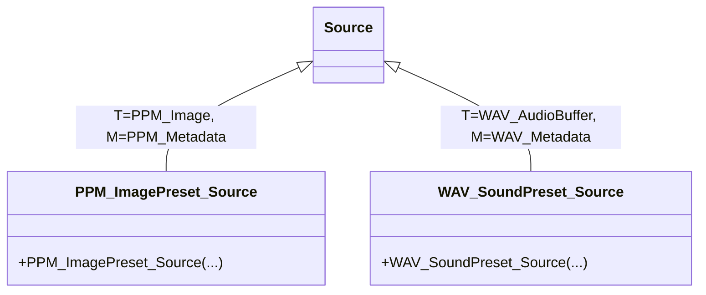
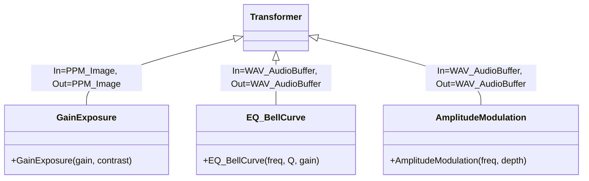
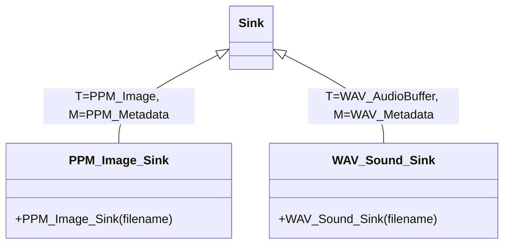
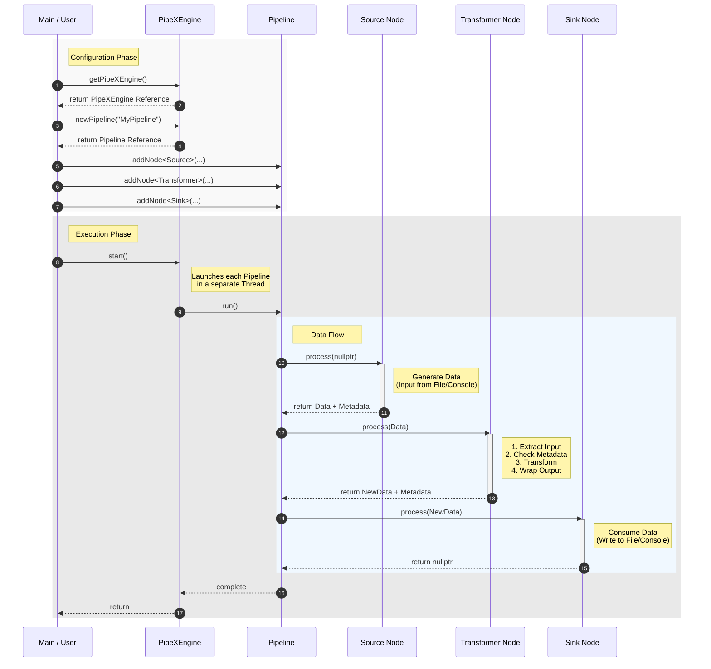

# PipeX - Data Processing Pipeline Framework
[](https://isocpp.org/)
[](https://cmake.org/)
[](https://github.com/google/googletest)
[]()


## 1. Titolo progetto e nome gruppo
**Titolo:** PipeX - Data Processing Pipeline Framework  
**Gruppo:** Matteo Ranzi

## 2. Data e versione del documento
**Data:** 3 Gennaio 2026  
**Versione:** 1.0

## 3. Riferimenti dei componenti del Gruppo
- **Matteo Ranzi** (matteo.ranzi@studenti.unitn.it)

## 4. Indice del progetto
1. [Descrizione del progetto](#5-descrizione-del-progetto)
2. [Elenco e descrizione dei Requisiti](#6-elenco-e-descrizione-dei-requisiti)
    - [Istruzioni per la Compilazione](#istruzioni-per-la-compilazione)
3. [Attività svolte per la realizzazione della soluzione](#7-attività-svolte-per-la-realizzazione-della-soluzione)
4. [Attività di implementazione](#8-attività-di-implementazione)
    - [OOD (Object-Oriented Design)](#8a-ood-object-oriented-design)
    - [Strategie di Implementazione dei Nodi](#8b-strategie-di-implementazione-dei-nodi)
    - [Descrizione degli Use Case](#8c-descrizione-degli-use-case)
    - [Eventuale base di dati utilizzata](#8d-eventuale-base-di-dati-utilizzata)
    - [Modalità di interazione](#8e-modalità-di-interazione-con-lapplicazione)
5. [Altre indicazioni utili](#9-indicazioni-utili)
    - [Descrizione di eventuali librerie integrate](#9a-descrizione-di-eventuali-librerie-integrate)
    - [Pattern e Algoritmi del Core Framework](#9b-pattern-e-algoritmi-del-core-framework)
    - [Organizzazione del Codice Sorgente](#9c-organizzazione-del-codice-sorgente)
6. [Gestione Errori ed Eccezioni](#10-gestione-errori-ed-eccezioni)
7. [Bibliografia](#11-bibliografia)

---

## 5. Descrizione del progetto

**PipeX** è un framework **header-only C++11** progettato per la costruzione di pipeline di elaborazione dati modulari, componibili ed efficienti. Il framework permette di definire flussi di lavoro lineari in cui i dati vengono generati, trasformati, filtrati e infine consumati da una serie di nodi interconnessi.

L'obiettivo principale di PipeX è fornire un'interfaccia C++ moderna e pulita per la creazione di pipeline, incoraggiando la modularità e la riusabilità attraverso l'uso di nodi basati su template. Il sistema è progettato per essere estensibile, permettendo agli utenti di implementare facilmente nuovi tipi di nodi personalizzati.

Caratteristiche principali:
- **Header-only:** Nessuna necessità di linking complesso, facile integrazione.
- **Compatibilità C++11:** Utilizza funzionalità moderne del linguaggio (smart pointers, lambda functions, move semantics).
- **Type Safety & Polymorphism:** Utilizza il pattern **CRTP (Curiously Recurring Template Pattern)** per combinare polimorfismo statico e sicurezza dei tipi, riducendo l'overhead delle chiamate virtuali dove possibile e garantendo che i tipi di dati tra i nodi siano coerenti.
- **Gestione della Memoria:** Uso estensivo di `std::unique_ptr` per la gestione automatica della memoria e il trasferimento di proprietà dei dati lungo la pipeline.
- **Sistema di Debug:** Macro configurabili per il tracciamento del flusso di dati e del ciclo di vita degli oggetti.
- **Supporto Metadati:** I dati che fluiscono nella pipeline possono trasportare metadati (es. frequenza di campionamento audio, dimensioni immagine) che vengono propagati e verificati dai nodi.

---

## 6. Elenco e descrizione dei Requisiti

Per compilare ed eseguire PipeX sono necessari i seguenti requisiti:

- **Compilatore C++:** Compatibile con lo standard **C++11** o superiore (GCC, Clang, MSVC).
- **CMake:** Versione **3.15** o superiore per la gestione della build.
- **GoogleTest:** Framework per i test unitari (scaricato automaticamente da CMake tramite `FetchContent`).
- **Sistema Operativo:** Cross-platform (testato su macOS, compatibile con Linux e Windows).

### Istruzioni per la Compilazione

**Passaggi per la compilazione ed esecuzione:**

1.  **Creazione directory di build:**
    ```bash
    mkdir build
    cd build
    ```
2.  **Configurazione:**
```bash
cmake ..
```
    *Nota: CMake scaricherà automaticamente GoogleTest se non presente.*

**Configurazione Log di Debug:**
È possibile controllare il livello di verbosità dei log di debug configurando la variabile CMake `GLOBAL_PRINT_DEBUG_LEVEL`.
I livelli disponibili sono:
- `0` (NONE): Nessun log.
    - `1` (ERROR): Solo errori.
    - `2` (WARN): Errori e avvisi.
    - `3` (INFO): Log completi (default).

      Esempio per disabilitare i log:
```bash
cmake -DGLOBAL_PRINT_DEBUG_LEVEL=0 ..
```

3.  **Compilazione:**
```bash
cmake --build .
```

4.  **Esecuzione Applicazione:**
    ```bash
    ./app
    ```

5.  **Esecuzione Test:**
    ```bash
    ctest --output-on-failure
    ```

---

## 7. Attività svolte per la realizzazione della soluzione

Il processo di sviluppo è stato iterativo e si è articolato nelle seguenti fasi principali:

1.  **Analisi dei Requisiti e Progettazione Architetturale:**
    *   **Studio dello Stato dell'Arte:** Analisi di framework esistenti (GStreamer, Apache Beam) per comprendere i pattern di progettazione delle pipeline dati.
    *   **Definizione dell'Architettura:** Progettazione del sistema basato su un Engine centrale (`PipeXEngine`) che gestisce pipeline indipendenti. Scelta del pattern **CRTP** (Curiously Recurring Template Pattern) per i nodi al fine di combinare l'interfaccia polimorfica necessaria alla pipeline (`INode`) con le ottimizzazioni di tipo statico all'interno dei nodi specifici.
    *   **Design del Sistema di Tipi:** Ideazione del meccanismo di **Type Erasure** (`IData` -> `Data<T>`) per permettere il passaggio di dati eterogenei attraverso un'interfaccia comune, garantendo al contempo la Type Safety a runtime tramite controlli dinamici.

2.  **Implementazione del Core Framework:**
    *   Sviluppo delle interfacce base (`INode`, `IData`) e della classe template `NodeCRTP`, che costituisce il cuore logico del framework gestendo l'unwrapping e il wrapping automatico dei dati.
    *   Implementazione dei nodi primitivi generici: `Source` (generazione), `Sink` (terminazione), `Filter` (selezione) e `Transformer` (modifica), utilizzando `std::function` per permettere la definizione della logica tramite lambda expression.
    *   Implementazione della classe `Pipeline` per la gestione sequenziale dei nodi e del `PipeXEngine` per l'orchestrazione parallela.

3.  **Sviluppo delle Estensioni (Proof of Concept):**
    *   **Modulo Immagini:** Definizione delle strutture dati per immagini PPM. Implementazione di nodi specifici come `GainExposure` (algoritmo sigmoide per contrasto/esposizione) e nodi di I/O per file `.ppm`.
    *   **Modulo Audio:** Definizione di buffer audio e metadati WAV. Implementazione di algoritmi DSP (Digital Signal Processing) complessi come filtri Biquad (`EQ_BellCurve`) e modulazione di ampiezza (`AmplitudeModulation`), oltre alla gestione dell'header WAV per l'I/O.
    *   **Integrazione Metadati:** Estensione del sistema `IData` per trasportare metadati (`IMetadata`) essenziali per l'elaborazione (es. sample rate audio, dimensioni immagine), con controlli di compatibilità a runtime.

4.  **Refactoring, Ottimizzazione e Thread Safety:**
    *   **Gestione Concorrenza:** Identificazione di criticità nell'I/O su console durante l'esecuzione parallela. Sviluppo della classe `Console_threadsafe` e dei relativi nodi (`ConsoleSource_ts`, `ConsoleSink_ts`) per sincronizzare l'accesso a `std::cout` tramite mutex.
    *   **Correzione Bug Critici:** Risoluzione di problemi legati alla *Move Semantics* (es. copie involontarie nei nodi filtro) e alla gestione della memoria (uso corretto di `std::unique_ptr`).
    *   **Sistema di Build:** Configurazione avanzata di **CMake** per la gestione delle dipendenze (GoogleTest), livelli di debug configurabili e compilazione cross-platform.

5.  **Testing e Validazione:**
    *   Integrazione del framework **GoogleTest**.
    *   Scrittura di Unit Test per verificare la logica dei singoli nodi.
    *   Scrittura di Integration Test per validare il flusso dati in pipeline complesse e la corretta propagazione delle eccezioni (es. `TypeMismatchExpection`).

---

## 8. Attività di implementazione

### 8.a OOD (Object-Oriented Design)

Il design di PipeX si basa su una gerarchia di classi che sfrutta sia l'ereditarietà classica che il polimorfismo statico tramite CRTP.

#### Diagramma delle Classi (Semplificato)




#### Descrizione Oggetti e Relazioni

1.  **`PipeXEngine` (Singleton):**
    -   **Ruolo:** Punto di ingresso principale e gestore delle pipeline.
    -   **Metodi:**
        - `getPipexEngine()` (accesso istanza),
        -  `newPipeline()` (crea e registra una nuova pipeline),
        - `start()` (avvia in parallelo l'esecuzione di tutte le pipeline registrate).
    -   **Relazioni:** Contiene una lista di oggetti `Pipeline`.
    -   **Concorrenza:** Il metodo `start()` avvia ogni pipeline registrata in un **thread dedicato**, permettendo l'esecuzione parallela di flussi di dati indipendenti.

2.  **`Pipeline`:**
    -   **Ruolo:** Rappresenta una singola catena di elaborazione dati.
    -   **Proprietà:**
        - `name` (identificativo),
        - `nodes` (lista di puntatori a `INode`).
    -   **Metodi:**
        - `addNode<NodeType>(args...)` (aggiunge un nodo alla catena),
        - `run()` (esegue la pipeline sequenzialmente).
    -   **Relazioni:** Aggrega oggetti `INode`.

3.  **`INode` (Abstract Base Class):**
    -   **Ruolo:** Interfaccia base polimorfica per tutti i nodi. Permette alla `Pipeline` di memorizzare nodi eterogenei.
    -   **Metodi:**
        - `clone()` (pattern Prototype per la copia),
        - `process()` (interfaccia pubblica di elaborazione che accetta/ritorna `IData`).

4.  **`NodeCRTP<Derived, InputT, OutputT, MetadataT>`:**
    -   **Ruolo:** Classe base template che implementa la logica comune di gestione dei tipi.
    -   **Funzionalità:** Gestisce l'unwrapping dei dati da `IData` a `std::vector<InputT>` e il wrapping dell'output in `IData`. Gestisce la propagazione e validazione dei metadati.
    -   **Relazioni:** Eredita da `INode`.

5.  **Nodi Primitivi (`Source`, `Sink`, `Filter`, `Transformer`, `Processor`):**
    Ogni nodo primitivo sovrascrive e implementa il metodo `std::vector<OutputT> processImpl(std::vector<InputT>)`, richiamando al suo interno la lambda function ricevuta come parametro del costruttore.
    - **`Source<T>`:** Genera dati. Non ha input. Utilizza una `std::function<InputT()>` per produrre dati.
    - **`Sink<T>`:** Consuma dati. Non produce output per la pipeline successiva. Utilizza una `std::function<void(const T&)>` per consumare dati.
    - **`Filter<T>`:** Filtra i dati in base a un predicato (`std::function<bool(const T&)>`). Input e Output sono dello stesso tipo.
    - **`Transformer<InputT, OutputT>`:** Trasforma i dati da un tipo all'altro tramite una funzione di trasformazione `std::function<OutputT(InputT&)>`.
    - **`Processor<InputT, OutputT>`:** Riceve l'intero buffer di dati `std::vector<InputT>`, permettendo una manipolazione che prevede l'uso di tutti i dati che scorrono nella pipeline. A sua volta, restituisce l'intero buffer di dati `std::vector<OutputT>`. Per fare ciò, utilizza la funzione:
      `std::function<std::vector<OutputT>(std::vector<InputT>&)>`

6.  **`IData` e `Data<T>`:**
    -   **Ruolo:** Wrapper per i dati che fluiscono tra i nodi (Type Erasure). `IData` è l'interfaccia base, `Data<T>` è l'implementazione concreta che contiene `std::vector<T>`.
    -   **Proprietà:** `metadata` (puntatore a `IMetadata`).

#### Gestione dei Dati e Type Erasure

Uno degli aspetti critici di PipeX è la capacità di gestire una pipeline eterogenea in cui i nodi possono avere tipi di input e output differenti (es. `NodeA<int, float>` -> `NodeB<float, string>`). Poiché la classe `Pipeline` deve memorizzare una lista generica di nodi, non può conoscere a tempo di compilazione i tipi esatti di ogni stadio.

Per risolvere questo problema, PipeX utilizza la tecnica della **Type Erasure**:

1.  **Interfaccia Comune:** Tutti i dati scambiati tra i nodi sono incapsulati in oggetti che implementano l'interfaccia base astratta `IData`.
2.  **Wrapper Concreto:** La classe template `Data<T>` eredita da `IData` e contiene il payload effettivo (`std::vector<T>`).
3.  **Polimorfismo:** La `Pipeline` vede solo puntatori a `IData`. Passa questi puntatori al metodo `process(std::unique_ptr<IData>)` del nodo successivo.
4.  **Estrazione Sicura:** All'interno del nodo (nella classe base `NodeCRTP`), il puntatore `IData` viene convertito dinamicamente (tramite `dynamic_cast` o meccanismi simili verificati) nel tipo concreto atteso `Data<InputT>`. Se il tipo non corrisponde, viene lanciata un'eccezione `TypeMismatchExpection`.

**Diagramma del Flusso di Type Erasure**



#### Estensione del Framework: Audio & Image Processing

Il framework è stato esteso con nodi specifici per l'elaborazione di immagini e audio, dimostrando la flessibilità del design.

Per migliorare la leggibilità, i diagrammi sono organizzati per tipologia di nodo primitivo:
`Source`, `Transformer` e `Sink`.

**1. Sorgenti (Sources)**

Rappresentano i nodi generatori di dati per le estensioni Immagini e Audio.




**2. Trasformatori (Transformers)**
Rappresentano i nodi che modificano i dati in transito.




**3. Terminatori (Sinks)**
Rappresentano i nodi che consumano i dati finali della pipeline.



#### Dettaglio Nodi Implementati (Audio & Image)

Di seguito vengono descritti i nodi specifici implementati per le estensioni Audio e Immagini, con i relativi parametri di configurazione.

**1. Estensione Immagini (PPM)**

| Nodo                         | Tipo        | Descrizione                                                                                         | Parametri Costruttore                                                                                                                                                   |
|:-----------------------------|:------------|:----------------------------------------------------------------------------------------------------|:------------------------------------------------------------------------------------------------------------------------------------------------------------------------|
| **`PPM_ImagePreset_Source`** | Source      | Genera immagini sintetiche basate su pattern predefiniti.                                           | • `node_name`: Nome del nodo.<br>• `width`, `height`: Dimensioni immagine.<br>• `preset`: ID del pattern (es. gradiente).<br>• `count`: Numero di immagini da generare. |
| **`GainExposure`**           | Transformer | Regola esposizione e contrasto usando una curva sigmoidea per simulare la risposta della pellicola. | • `node_name`: Nome del nodo.<br>• `gain`: Regolazione esposizione (in stop).<br>• `contrast`: Fattore di contrasto (default 1.0).                                      |
| **`PPM_Image_Sink`**         | Sink        | Salva le immagini su disco in formato PPM (P3).                                                     | • `node_name`: Nome del nodo.<br>• `filename`: Percorso base del file di output (verrà aggiunto un indice e l'estensione).                                              |

**2. Estensione Audio (WAV)**

| Nodo                         | Tipo        | Descrizione                                                                           | Parametri Costruttore                                                                                                                                                                                                                                                                                        |
|:-----------------------------|:------------|:--------------------------------------------------------------------------------------|:-------------------------------------------------------------------------------------------------------------------------------------------------------------------------------------------------------------------------------------------------------------------------------------------------------------|
| **`WAV_SoundPreset_Source`** | Source      | Genera flussi audio sintetici (toni puri o rumore).                                   | • `node_name`: Nome del nodo.<br>• `nStreams`: Numero di tracce da generare.<br>• `sampleRate`: Frequenza di campionamento (es. 44100).<br>• `bitsPerSample`: Profondità in bit (es. 16).<br>• `durationSec`: Durata in secondi.<br>• `preset`: Tipo di suono (0: Sinusoide, 1: White Noise, 2: Pink Noise). |
| **`EQ_BellCurve`**           | Transformer | Applica un filtro equalizzatore parametrico (Peaking EQ) del secondo ordine (Biquad). | • `node_name`: Nome del nodo.<br>• `centerFrequency`: Frequenza centrale in Hz.<br>• `qFactor`: Fattore Q (larghezza di banda).<br>• `gainDB`: Guadagno/Attenuazione in dB.                                                                                                                                  |
| **`AmplitudeModulation`**    | Transformer | Applica un effetto Tremolo modulando l'ampiezza del segnale con un LFO.               | • `node_name`: Nome del nodo.<br>• `rateHz`: Frequenza dell'oscillatore (LFO) in Hz.<br>• `depth`: Intensità dell'effetto (0.0 - 1.0).                                                                                                                                                                       |
| **`WAV_Sound_Sink`**         | Sink        | Salva i buffer audio su disco in formato WAV standard.                                | • `node_name`: Nome del nodo.<br>• `filename`: Percorso base del file di output.                                                                                                                                                                                                                             |


---
### 8.b Strategie di Implementazione dei Nodi

Il framework supporta due modalità principali per definire la logica di elaborazione:

1.  **Derivazione (Inheritance):**
    Utilizzata per creare componenti riutilizzabili, complessi o configurabili.
    -   Si crea una nuova classe che eredita da un nodo primitivo (`Source`, `Transformer`, `Filter`, etc.).
    -   Il costruttore della classe derivata configura il nodo base (spesso passando una lambda che cattura `this`).
    -   *Esempio:* `GainExposure` eredita da `Transformer`. Il suo costruttore accetta parametri (gain, contrast) e configura la funzione di trasformazione interna per usare il metodo privato `applyGain`. Questo incapsula la logica complessa (algoritmo sigmoide) e i parametri in una classe pulita.

2.  **Uso Diretto (Lambda Functions):**
    Utilizzata per operazioni semplici, "one-off" o prototipazione rapida.
    -   Si istanzia direttamente un nodo primitivo (`Transformer`, `Filter`, etc.).
    -   Si passa una lambda function al costruttore che definisce la logica.
    -   *Esempio:* `Transformer<int, int>("Doubling", [](int& x){ return x * 2; })`. Non è necessario creare una classe `DoublerNode` per un'operazione così semplice.

Questa dualità permette di bilanciare rapidità di sviluppo (lambda) e ingegnerizzazione del software (classi dedicate).

---

### 8.c Descrizione degli Use Case

#### Diagramma di Sequenza: Flusso di Esecuzione e Dati

Il seguente diagramma illustra un esempio di interazione tra l'utente, l'engine e i nodi durante la configurazione e l'esecuzione di una pipeline, evidenziando il flusso dei dati e dei metadati.



#### Esempi di Utilizzo (Scenari)

1.  **Generazione ed Elaborazione Immagini (PPM):**
    -   **Attori:** Utente (tramite `main.cpp`).
    -   **Oggetti:**
        - `PPM_ImagePreset_Source` (genera immagine pattern),
        - `GainExposure` (applica filtro esposizione),
        - `PPM_Image_Sink` (scrive file .ppm).
    -   **Flusso:** La sorgente crea un'immagine in memoria -> Il nodo GainExposure modifica i valori dei pixel -> Il Sink scrive il risultato su disco.

2.  **Generazione ed Elaborazione Audio (WAV):**
    -   **Attori:** Utente.
    -   **Oggetti:**
        - `WAV_SoundPreset_Source` (genera rumore/toni),
        - `EQ_BellCurve` (filtro equalizzatore),
        - `AmplitudeModulation` (effetto tremolo),
        - `WAV_Sound_Sink` (scrive file .wav).
    -   **Flusso:** Generazione buffer audio -> Applicazione filtri DSP -> Salvataggio file WAV.

### 8.d Eventuale base di dati utilizzata

Non viene utilizzato un database tradizionale (SQL/NoSQL). I dati sono gestiti come flussi in memoria e persistiti su **File System**:

-   **File Immagine (.ppm):** Formato Portable Pixel Map (P3 o P6). File di testo o binari semplici che rappresentano griglie di pixel RGB.
-   **File Audio (.wav):** Formato WAVE standard. Contiene un header (RIFF) con metadati (sample rate, bit depth, canali) seguito dai dati audio PCM grezzi.

### 8.e Modalità di interazione con l’applicazione

L'interazione è principalmente **programmatica** (definita nel `main.cpp`) e tramite **Console (CLI)** per l'output di debug e log.

Definizione della pipeline nel codice sorgente
-   **Input:**  In base al tipo di `Source`: console, file, vettore catturato nella lambda
-   **Output:** In base al tipo di `Sink`: console, file, vettore catturato nella lambda.
    Esempio audio/video:
    -   File generati nelle cartelle `output/image/` e `output/audio/`.
    -   Log dettagliati su console che mostrano: creazione nodi, flusso dati, chiamate a costruttori/distruttori (utile per debug gestione memoria).

Esempio di output console:
```text
[Pipeline] "WAV Audio generation" {0x...}.Constructor(std::string)
[Source] "WAV Audio Sample Source" {0x...}.Constructor(...)
[Transformer] "EQ Bell Curve" {0x...}.Constructor(...)
...
[Pipeline] "WAV Audio generation" {0x...}.run()
...
```

---

## 9. Indicazioni utili


### 9.a Descrizione di eventuali librerie integrate

-   **`my_extended_cpp_standard`:** Una libreria di utilità personalizzata (inclusa nel progetto) che fornisce helper per la gestione della memoria (`my_memory.h`) e type traits (`my_type_traits.h`), estendendo le funzionalità standard del C++11.
-   **GoogleTest:** Framework standard de-facto per il testing C++, integrato tramite CMake FetchContent per garantire che i test siano sempre eseguibili in un ambiente isolato.

### 9.b Pattern e Algoritmi del Core Framework

Il cuore di PipeX si basa su diversi pattern architetturali e idiomi C++ avanzati per garantire performance, flessibilità e sicurezza dei tipi.

1.  **Curiously Recurring Template Pattern (CRTP):**
    -   **Utilizzo:** Nella classe `NodeCRTP<Derived, ...>`.
    -   **Scopo:** Realizzare polimorfismo statico. Permette alla classe base di invocare metodi dell'implementazione derivata (`processImpl`) senza il costo di una chiamata virtuale (vtable lookup) per la logica interna, mantenendo comunque l'interfaccia virtuale `INode` solo per la gestione esterna della pipeline.

2.  **Type Erasure:**
    -   **Utilizzo:** Classi `IData` e `Data<T>`.
    -   **Scopo:** Permettere alla `Pipeline` di gestire una collezione eterogenea di dati. I nodi comunicano tramite puntatori a `IData` (tipo cancellato), e il tipo reale viene recuperato a runtime tramite `dynamic_cast` sicuro all'interno dei nodi, garantendo che ogni nodo riceva esattamente il tipo di dato che si aspetta.

3.  **Template Method Pattern:**
    -   **Utilizzo:** Nel metodo `process()` di `INode` / `NodeCRTP`.
    -   **Scopo:** Definire lo scheletro dell'algoritmo di elaborazione (estrazione input -> pre-hook -> elaborazione -> post-hook -> wrapping output) nella classe base, delegando i dettagli specifici alle sottoclassi.

4.  **Singleton Pattern:**
    -   **Utilizzo:** Classe `PipeXEngine`.
    -   **Scopo:** Garantire l'esistenza di un'unica istanza di coordinamento per l'esecuzione delle pipeline e la gestione delle risorse globali.

5.  **RAII (Resource Acquisition Is Initialization):**
    - **Utilizzo:** Gestione di `std::unique_ptr` per nodi e dati.
    -   **Scopo:** Garantire che la memoria e le risorse vengano rilasciate automaticamente e in modo deterministico, prevenendo memory leak anche in caso di eccezioni.

6. **Factory Method Pattern:**
    -   **Utilizzo:** Metodo `addNode<NodeType>(args...)` in `Pipeline`.
    -   **Scopo:** Permettere la creazione di nodi di tipo specifico senza esporre la logica di istanziazione all'utente, facilitando l'aggiunta di nuovi tipi di nodi in futuro.

### 9.c Organizzazione del Codice Sorgente

Il codice sorgente è organizzato separando chiaramente le interfacce (header files) dalle implementazioni, seguendo una struttura modulare.

- **`include/PipeX/`**: Contiene tutti gli header files del framework.
    - **`PipeXEngine.h`**: Definizione del motore principale e gestione delle pipeline.
    - **`Pipeline.h`**: Definizione della classe Pipeline.
    - **`nodes/`**: Definizioni dei nodi (interfaccia `INode`, template `NodeCRTP`, e nodi primitivi come `Source`, `Sink`, `Filter`, `Transformer` e `Processor`).
    - **`data/`**: Definizioni per il sistema di tipi (`IData`, `Data<T>`).
    - **`metadata/`**: Gestione dei metadati associati ai dati.
    - **`errors/`**: Definizioni delle eccezioni personalizzate.
    - **`utils/`**: Utility varie.
    - **`debug/`**: Strumenti per il debug e logging.

- **`src/`**: Contiene i file sorgente `.cpp`.
    - **`main.cpp`**: Entry point dell'applicazione dimostrativa.
    - **`PipeX/`**: Implementazioni specifiche del framework.
        - **`PipeX.cpp`**: Implementazione di funzionalità core non-template.
        - **`Image/`**: Implementazioni specifiche per l'elaborazione immagini (es. nodi PPM).
        - **`Sound/`**: Implementazioni specifiche per l'elaborazione audio (es. nodi WAV, filtri DSP).

---

## 10. Gestione Errori ed Eccezioni

PipeX implementa un robusto sistema di gestione degli errori basato su eccezioni, permettendo di intercettare e gestire problemi sia in fase di configurazione che di esecuzione. Tutte le eccezioni derivano dalla classe base `PipeXException`.

| Eccezione                           | Descrizione                                          | Scenario Tipico                                                                                                                                                 |
|:------------------------------------|:-----------------------------------------------------|:----------------------------------------------------------------------------------------------------------------------------------------------------------------|
| **`PipeXException`**                | Classe base per tutte le eccezioni del framework.    | Catch generico per errori del framework.                                                                                                                        |
| **`InvalidPipelineException`**      | Errore strutturale nella definizione della pipeline. | Tentativo di aggiungere un nodo non valido o configurazione incompleta.                                                                                         |
| **`NodeNameConflictException`**     | Conflitto di nomi tra i nodi.                        | Aggiunta di due nodi con lo stesso nome nella stessa pipeline (i nomi devono essere univoci per permettere l'operazione di rimozione nodo tramite il suo nome). |
| **`InvalidOperation`**              | Operazione non consentita nello stato corrente.      | Tentativo di modificare una pipeline mentre l'engine è in esecuzione (`isRunning == true`).                                                                     |
| **`TypeMismatchExpection`**         | Errore di tipo a runtime tra due nodi.               | Il Nodo A produce `int` ma il Nodo B si aspetta `string`. Rilevato durante `extractInputData`.                                                                  |
| **`MetadataTypeMismatchException`** | Incompatibilità dei metadati.                        | Un nodo riceve metadati diversi da quelli previsti, o metadati mancanti dove richiesti.                                                                         |

Il framework garantisce che un'eccezione in una pipeline non comprometta l'esecuzione delle altre pipeline parallele gestite da `PipeXEngine`.

---

## 11. Bibliografia

1.  **C++ Reference:** [https://en.cppreference.com/](https://en.cppreference.com/) - Riferimento per standard C++11, smart pointers, e type traits.
2.  **CMake Documentation:** [https://cmake.org/documentation/](https://cmake.org/documentation/) - Guida per la configurazione del sistema di build.
3.  **GoogleTest User Guide:** [https://google.github.io/googletest/](https://google.github.io/googletest/) - Documentazione per il framework di testing.
4.  **Audio EQ Cookbook (Robert Bristow-Johnson):** Riferimento standard per le formule dei filtri Biquad audio.
5.  **Netpbm Format Specification:** [http://netpbm.sourceforge.net/doc/ppm.html](http://netpbm.sourceforge.net/doc/ppm.html) - Specifiche del formato immagine PPM.
6.  **CRTP (Curiously Recurring Template Pattern):** [https://en.cppreference.com/w/cpp/language/crtp.html](https://en.cppreference.com/w/cpp/language/crtp.html)
7.  **Functors in C++:** [https://www.geeksforgeeks.org/cpp/functors-in-cpp/](https://www.geeksforgeeks.org/cpp/functors-in-cpp/)
8.  **Lambda Expressions:** [https://en.cppreference.com/w/cpp/language/lambda.html](https://en.cppreference.com/w/cpp/language/lambda.html)
9.  **STL Containers:** [https://cplusplus.com/reference/stl/](https://cplusplus.com/reference/stl/)
10. **RAII (Resource Acquisition Is Initialization):** [https://en.cppreference.com/w/cpp/language/raii.html](https://en.cppreference.com/w/cpp/language/raii.html)
11. **SFINAE:** [https://www.geeksforgeeks.org/cpp/substitution-failure-is-not-an-error-sfinae-in-cpp/](https://www.geeksforgeeks.org/cpp/substitution-failure-is-not-an-error-sfinae-in-cpp/)
12. **STL Streams Iterators:** [https://www.geeksforgeeks.org/cpp/stdistream_iterator-stdostream_iterator-c-stl/](https://www.geeksforgeeks.org/cpp/stdistream_iterator-stdostream_iterator-c-stl/)
13. **Factory Method Pattern:** [https://refactoring.guru/design-patterns/factory-method](https://refactoring.guru/design-patterns/factory-method)
14. **Smart Pointers:** [https://en.cppreference.com/book/intro/smart_pointers](https://en.cppreference.com/book/intro/smart_pointers)
15. **std::function:** [https://www.geeksforgeeks.org/cpp/std-function-in-cpp/](https://www.geeksforgeeks.org/cpp/std-function-in-cpp/)
16. **Universal References:** [https://isocpp.org/blog/2012/11/universal-references-in-c11-scott-meyers](https://isocpp.org/blog/2012/11/universal-references-in-c11-scott-meyers)
17. **Forwarding References:** [https://en.cppreference.com/w/cpp/utility/forward.html](https://en.cppreference.com/w/cpp/utility/forward.html)
18. **make_unique:** [https://www.geeksforgeeks.org/cpp/cpp-14-make_unique/](https://www.geeksforgeeks.org/cpp/cpp-14-make_unique/)
19. **Parameter Pack:** [https://en.cppreference.com/w/cpp/language/parameter_pack.html](https://en.cppreference.com/w/cpp/language/parameter_pack.html)
20. **Command Pattern (Deferred Execution):** [https://refactoring.guru/design-patterns/command](https://refactoring.guru/design-patterns/command)
21. **Type Traits:** [https://en.cppreference.com/w/cpp/header/type_traits.html](https://en.cppreference.com/w/cpp/header/type_traits.html)
22. **enable_if:** [https://en.cppreference.com/w/cpp/types/enable_if.html](https://en.cppreference.com/w/cpp/types/enable_if.html)
23. **decltype:** [https://en.cppreference.com/w/cpp/language/decltype.html](https://en.cppreference.com/w/cpp/language/decltype.html)

---