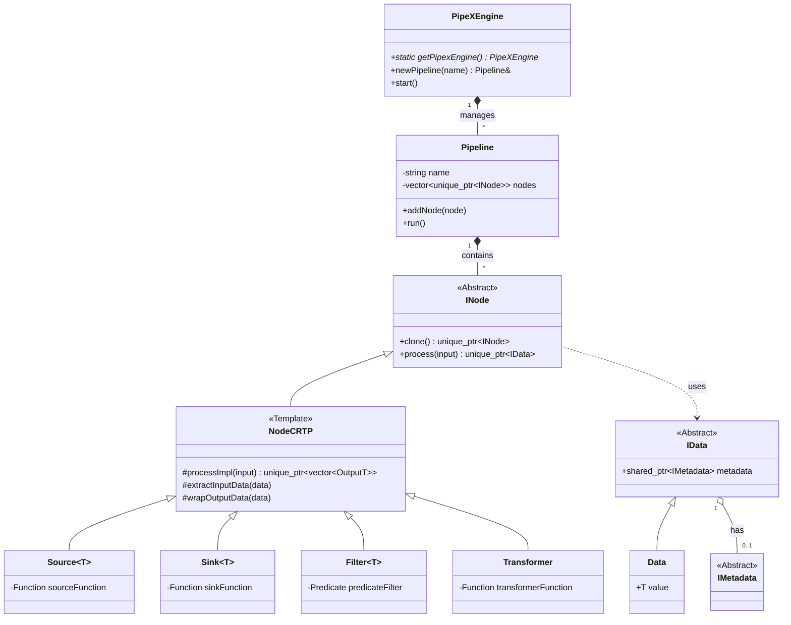
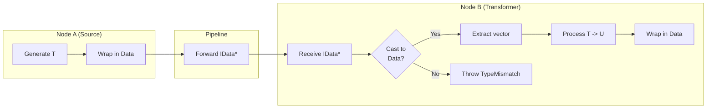
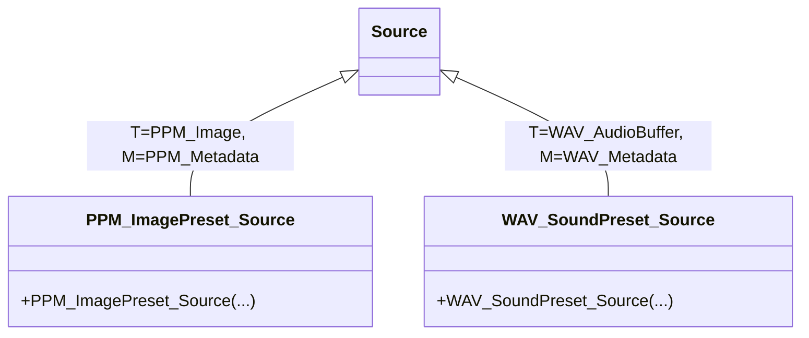
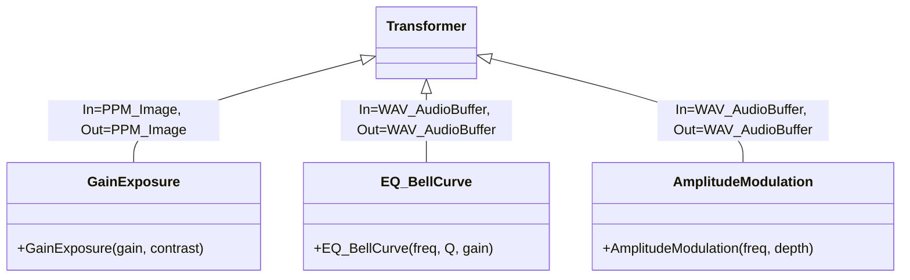
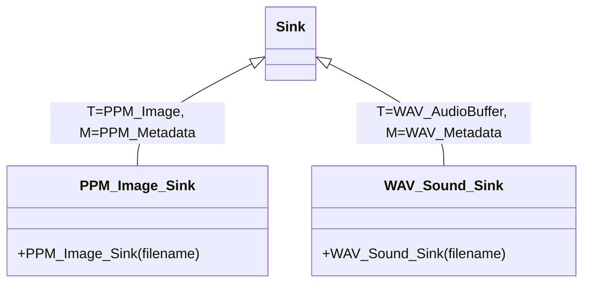
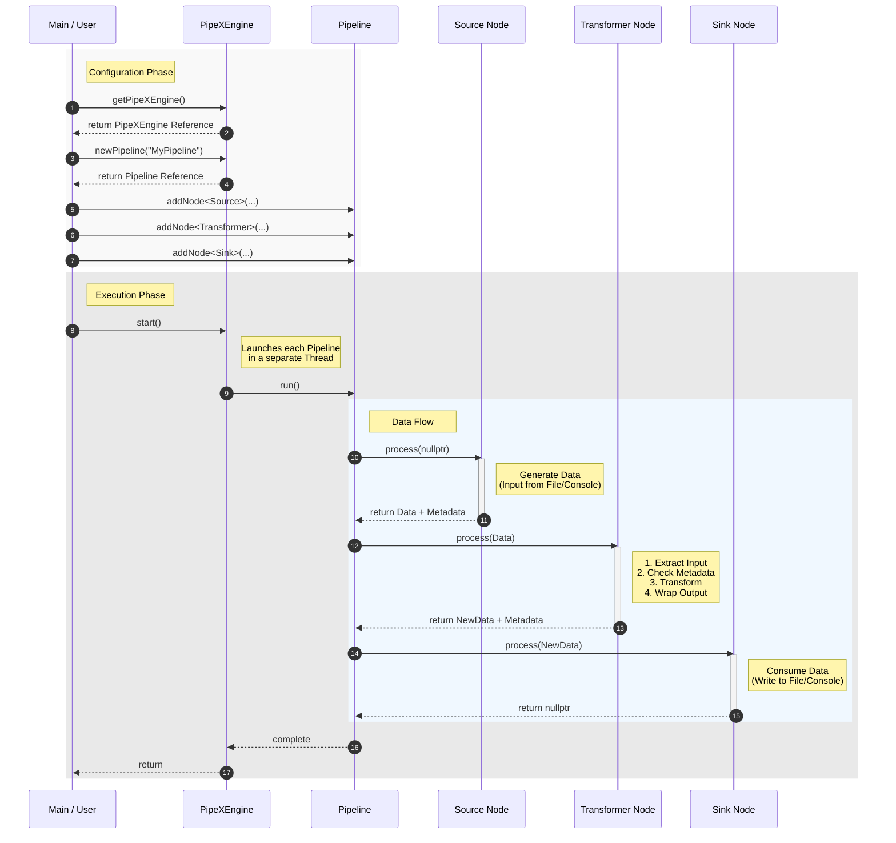

# PipeX - Data Processing Pipeline Framework
[](https://isocpp.org/)
[](https://cmake.org/)
[](https://github.com/google/googletest)
[]()


## 1. Project Title and Group Name
**Title:** PipeX - Data Processing Pipeline Framework  
**Group:** Matteo Ranzi

## 2. Date and Version of the Document
**Date:** January 3, 2026  
**Version:** 1.0

## 3. Group Members References
- **Matteo Ranzi** (matteo.ranzi@studenti.unitn.it)

## 4. Project Index
1. [Project Description](#5-project-description)
2. [List and Description of Requirements](#6-list-and-description-of-requirements)
    - [Compilation Instructions](#compilation-instructions)
3. [Activities carried out for the realization of the solution](#7-activities-carried-out-for-the-realization-of-the-solution)
4. [Implementation Activities](#8-implementation-activities)
    - [OOD (Object-Oriented Design)](#8a-ood-object-oriented-design)
    - [Node Implementation Strategies](#8b-node-implementation-strategies)
    - [Use Case Description](#8c-use-case-description)
    - [Database used (if any)](#8d-database-used-if-any)
    - [Interaction Modes](#8e-interaction-modes-with-the-application)
5. [Other useful information](#9-useful-information)
    - [Description of integrated libraries](#9a-description-of-integrated-libraries)
    - [Core Framework Patterns and Algorithms](#9b-core-framework-patterns-and-algorithms)
6. [Error and Exception Management](#10-error-and-exception-management)
7. [Bibliography](#11-bibliography)

---

## 5. Project Description

**PipeX** is a **header-only C++11** framework designed for building modular, composable, and efficient data processing pipelines. The framework allows defining linear workflows where data is generated, transformed, filtered, and finally consumed by a series of interconnected nodes.

The main goal of PipeX is to provide a modern and clean C++ interface for creating pipelines, encouraging modularity and reusability through the use of template-based nodes. The system is designed to be extensible, allowing users to easily implement new custom node types.

Key Features:
- **Header-only:** No complex linking required, easy integration.
- **C++11 Compatibility:** Uses modern language features (smart pointers, lambda functions, move semantics).
- **Type Safety & Polymorphism:** Uses the **CRTP (Curiously Recurring Template Pattern)** to combine static polymorphism and type safety, reducing virtual call overhead where possible and ensuring data types between nodes are consistent.
- **Memory Management:** Extensive use of `std::unique_ptr` for automatic memory management and ownership transfer of data along the pipeline.
- **Debug System:** Configurable macros for tracking data flow and object lifecycle.
- **Metadata Support:** Data flowing in the pipeline can carry metadata (e.g., audio sampling rate, image dimensions) that are propagated and verified by nodes.

---

## 6. List and Description of Requirements

To compile and run PipeX, the following requirements are needed:

- **C++ Compiler:** Compatible with **C++11** standard or higher (GCC, Clang, MSVC).
- **CMake:** Version **3.15** or higher for build management.
- **GoogleTest:** Framework for unit tests (automatically downloaded by CMake via `FetchContent`).
- **Operating System:** Cross-platform (tested on macOS, compatible with Linux and Windows).

### Compilation Instructions

**Steps for compilation and execution:**

1.  **Create build directory:**
    ```bash
    mkdir build
    cd build
    ```
2.  **Configuration:**
```bash
cmake ..
```
    *Note: CMake will automatically download GoogleTest if not present.*

**Debug Log Configuration:**
You can control the verbosity level of debug logs by configuring the CMake variable `GLOBAL_PRINT_DEBUG_LEVEL`.
Available levels are:
- `0` (NONE): No logs.
  - `1` (ERROR): Only errors.
  - `2` (WARN): Errors and warnings.
  - `3` (INFO): Full logs (default).

    Example to disable logs:
```bash
cmake -DGLOBAL_PRINT_DEBUG_LEVEL=0 ..
```

3.  **Compilation:**
```bash
cmake --build .
```

4.  **Run Application:**
    ```bash
    ./app
    ```

5.  **Run Tests:**
    ```bash
    ctest --output-on-failure
    ```

---

## 7. Activities carried out for the realization of the solution

The development process was iterative and articulated in the following main phases:

1.  **Requirements Analysis and Architectural Design:**
    *   **State of the Art Study:** Analysis of existing frameworks (GStreamer, Apache Beam) to understand data pipeline design patterns.
    *   **Architecture Definition:** System design based on a central Engine (`PipeXEngine`) managing independent pipelines. Choice of **CRTP** (Curiously Recurring Template Pattern) for nodes to combine the polymorphic interface needed by the pipeline (`INode`) with static type optimizations within specific nodes.
    *   **Type System Design:** Conception of the **Type Erasure** mechanism (`IData` -> `Data<T>`) to allow passing heterogeneous data through a common interface, while ensuring runtime Type Safety via dynamic checks.

2.  **Core Framework Implementation:**
    *   Development of base interfaces (`INode`, `IData`) and the template class `NodeCRTP`, which constitutes the logical heart of the framework managing automatic data unwrapping and wrapping.
    *   Implementation of generic primitive nodes: `Source` (generation), `Sink` (termination), `Filter` (selection), and `Transformer` (modification), using `std::function` to allow logic definition via lambda expressions.
    *   Implementation of the `Pipeline` class for sequential node management and `PipeXEngine` for parallel orchestration.

3.  **Extensions Development (Proof of Concept):**
    *   **Image Module:** Definition of data structures for PPM images. Implementation of specific nodes like `GainExposure` (sigmoid algorithm for contrast/exposure) and I/O nodes for `.ppm` files.
    *   **Audio Module:** Definition of audio buffers and WAV metadata. Implementation of complex DSP (Digital Signal Processing) algorithms like Biquad filters (`EQ_BellCurve`) and amplitude modulation (`AmplitudeModulation`), as well as WAV header management for I/O.
    *   **Metadata Integration:** Extension of the `IData` system to carry essential metadata (`IMetadata`) for processing (e.g., audio sample rate, image dimensions), with runtime compatibility checks.

4.  **Refactoring, Optimization, and Thread Safety:**
    *   **Concurrency Management:** Identification of criticalities in console I/O during parallel execution. Development of the `Console_threadsafe` class and related nodes (`ConsoleSource_ts`, `ConsoleSink_ts`) to synchronize access to `std::cout` via mutex.
    *   **Critical Bug Fixes:** Resolution of issues related to *Move Semantics* (e.g., unintended copies in filter nodes) and memory management (correct use of `std::unique_ptr`).
    *   **Build System:** Advanced configuration of **CMake** for dependency management (GoogleTest), configurable debug levels, and cross-platform compilation.

5.  **Testing and Validation:**
    *   Integration of the **GoogleTest** framework.
    *   Writing Unit Tests to verify the logic of individual nodes.
    *   Writing Integration Tests to validate data flow in complex pipelines and correct exception propagation (e.g., `TypeMismatchExpection`).

---

## 8. Implementation Activities

### 8.a OOD (Object-Oriented Design)

PipeX design is based on a class hierarchy that leverages both classical inheritance and static polymorphism via CRTP.

#### Class Diagram (Simplified)




#### Objects and Relationships Description

1.  **`PipeXEngine` (Singleton):**
    -   **Role:** Main entry point and pipeline manager.
    -   **Methods:**
        - `getPipexEngine()` (instance access),
        -  `newPipeline()` (creates and registers a new pipeline),
        - `start()` (starts parallel execution of all registered pipelines).
    -   **Relationships:** Contains a list of `Pipeline` objects.
    -   **Concurrency:** The `start()` method launches each registered pipeline in a **dedicated thread**, allowing parallel execution of independent data flows.

2.  **`Pipeline`:**
    -   **Role:** Represents a single data processing chain.
    -   **Properties:**
        - `name` (identifier),
        - `nodes` (list of pointers to `INode`).
    -   **Methods:**
        - `addNode<NodeType>(args...)` (adds a node to the chain),
        - `run()` (executes the pipeline sequentially).
    -   **Relationships:** Aggregates `INode` objects.

3.  **`INode` (Abstract Base Class):**
    -   **Role:** Polymorphic base interface for all nodes. Allows `Pipeline` to store heterogeneous nodes.
    -   **Methods:**
        - `clone()` (Prototype pattern for copying),
        - `process()` (public processing interface accepting/returning `IData`).

4.  **`NodeCRTP<Derived, InputT, OutputT, MetadataT>`:**
    -   **Role:** Template base class implementing common type management logic.
    -   **Functionality:** Manages data unwrapping from `IData` to `std::vector<InputT>` and output wrapping into `IData`. Manages metadata propagation and validation.
    -   **Relationships:** Inherits from `INode`.

5.  **Primitive Nodes (`Source`, `Sink`, `Filter`, `Transformer`, `Processor`):**
    Each primitive node overrides and implements the `std::vector<OutputT> processImpl(std::vector<InputT>)` method, invoking the lambda function received as a constructor parameter internally.
    - **`Source<T>`:** Generates data. Has no input. Uses a `std::function<InputT()>` to produce data.
    - **`Sink<T>`:** Consumes data. Produces no output for the next pipeline. Uses a `std::function<void(const T&)>` to consume data.
    - **`Filter<T>`:** Filters data based on a predicate (`std::function<bool(const T&)>`). Input and Output are of the same type.
    - **`Transformer<InputT, OutputT>`:** Transforms data from one type to another via a transformation function `std::function<OutputT(InputT&)>`.
    - **`Processor<InputT, OutputT>`:** Receives the entire data buffer `std::vector<InputT>`, allowing manipulation that involves using all data flowing in the pipeline. In turn, it returns the entire data buffer `std::vector<OutputT>`. To do this, it uses the function:
      `std::function<std::vector<OutputT>(std::vector<InputT>&)>`

6.  **`IData` and `Data<T>`:**
    -   **Role:** Wrapper for data flowing between nodes (Type Erasure). `IData` is the base interface, `Data<T>` is the concrete implementation containing `std::vector<T>`.
    -   **Properties:** `metadata` (pointer to `IMetadata`).

#### Data Management and Type Erasure

One of the critical aspects of PipeX is the ability to manage a heterogeneous pipeline where nodes can have different input and output types (e.g., `NodeA<int, float>` -> `NodeB<float, string>`). Since the `Pipeline` class must store a generic list of nodes, it cannot know the exact types of each stage at compile time.

To solve this problem, PipeX uses the **Type Erasure** technique:

1.  **Common Interface:** All data exchanged between nodes are encapsulated in objects implementing the abstract base interface `IData`.
2.  **Concrete Wrapper:** The template class `Data<T>` inherits from `IData` and contains the actual payload (`std::vector<T>`).
3.  **Polymorphism:** The `Pipeline` sees only pointers to `IData`. It passes these pointers to the `process(std::unique_ptr<IData>)` method of the next node.
4.  **Safe Extraction:** Inside the node (in the base class `NodeCRTP`), the `IData` pointer is dynamically converted (via `dynamic_cast` or similar verified mechanisms) into the expected concrete type `Data<InputT>`. If the type does not match, a `TypeMismatchExpection` is thrown.

**Type Erasure Flow Diagram**



#### Framework Extension: Audio & Image Processing

The framework has been extended with specific nodes for image and audio processing, demonstrating design flexibility.

To improve readability, diagrams are organized by primitive node type:
`Source`, `Transformer` and `Sink`.

**1. Sources**

Represent data generator nodes for Image and Audio extensions.




**2. Transformers**
Represent nodes that modify data in transit.




**3. Terminators (Sinks)**
Represent nodes that consume the final pipeline data.



#### Implemented Nodes Detail (Audio & Image)

The following describes the specific nodes implemented for Audio and Image extensions, with their configuration parameters.

**1. Image Extension (PPM)**

| Node                         | Type        | Description                                                                                         | Constructor Parameters                                                                                                                                                   |
|:-----------------------------|:------------|:----------------------------------------------------------------------------------------------------|:------------------------------------------------------------------------------------------------------------------------------------------------------------------------|
| **`PPM_ImagePreset_Source`** | Source      | Generates synthetic images based on predefined patterns.                                           | • `node_name`: Node name.<br>• `width`, `height`: Image dimensions.<br>• `preset`: Pattern ID (e.g., gradient).<br>• `count`: Number of images to generate. |
| **`GainExposure`**           | Transformer | Adjusts exposure and contrast using a sigmoid curve to simulate film response. | • `node_name`: Node name.<br>• `gain`: Exposure adjustment (in stops).<br>• `contrast`: Contrast factor (default 1.0).                                      |
| **`PPM_Image_Sink`**         | Sink        | Saves images to disk in PPM format (P3).                                                     | • `node_name`: Node name.<br>• `filename`: Base path of the output file (an index and extension will be added).                                              |

**2. Audio Extension (WAV)**

| Node                         | Type        | Description                                                                           | Constructor Parameters                                                                                                                                                                                                                                                                                        |
|:-----------------------------|:------------|:--------------------------------------------------------------------------------------|:-------------------------------------------------------------------------------------------------------------------------------------------------------------------------------------------------------------------------------------------------------------------------------------------------------------|
| **`WAV_SoundPreset_Source`** | Source      | Generates synthetic audio streams (pure tones or noise).                                   | • `node_name`: Node name.<br>• `nStreams`: Number of tracks to generate.<br>• `sampleRate`: Sampling rate (e.g., 44100).<br>• `bitsPerSample`: Bit depth (e.g., 16).<br>• `durationSec`: Duration in seconds.<br>• `preset`: Sound type (0: Sine, 1: White Noise, 2: Pink Noise). |
| **`EQ_BellCurve`**           | Transformer | Applies a second-order parametric equalizer filter (Peaking EQ) (Biquad). | • `node_name`: Node name.<br>• `centerFrequency`: Center frequency in Hz.<br>• `qFactor`: Q factor (bandwidth).<br>• `gainDB`: Gain/Attenuation in dB.                                                                                                                                  |
| **`AmplitudeModulation`**    | Transformer | Applies a Tremolo effect by modulating signal amplitude with an LFO.               | • `node_name`: Node name.<br>• `rateHz`: Oscillator frequency (LFO) in Hz.<br>• `depth`: Effect intensity (0.0 - 1.0).                                                                                                                                                                       |
| **`WAV_Sound_Sink`**         | Sink        | Saves audio buffers to disk in standard WAV format.                                | • `node_name`: Node name.<br>• `filename`: Base path of the output file.                                                                                                                                                                                                                             |


---
### 8.b Node Implementation Strategies

The framework supports two main modes for defining processing logic:

1.  **Derivation (Inheritance):**
    Used to create reusable, complex, or configurable components.
    -   Create a new class inheriting from a primitive node (`Source`, `Transformer`, `Filter`, etc.).
    -   The derived class constructor configures the base node (often passing a lambda capturing `this`).
    -   *Example:* `GainExposure` inherits from `Transformer`. Its constructor accepts parameters (gain, contrast) and configures the internal transformation function to use the private method `applyGain`. This encapsulates complex logic (sigmoid algorithm) and parameters in a clean class.

2.  **Direct Use (Lambda Functions):**
    Used for simple, "one-off" operations or rapid prototyping.
    -   Directly instantiate a primitive node (`Transformer`, `Filter`, etc.).
    -   Pass a lambda function to the constructor defining the logic.
    -   *Example:* `Transformer<int, int>("Doubling", [](int& x){ return x * 2; })`. No need to create a `DoublerNode` class for such a simple operation.

This duality allows balancing development speed (lambda) and software engineering (dedicated classes).

---

### 8.c Use Case Description

#### Sequence Diagram: Execution and Data Flow

The following diagram illustrates an example of interaction between the user, the engine, and nodes during pipeline configuration and execution, highlighting data and metadata flow.



#### Usage Examples (Scenarios)

1.  **Image Generation and Processing (PPM):**
    -   **Actors:** User (via `main.cpp`).
    -   **Objects:**
        - `PPM_ImagePreset_Source` (generates pattern image),
        - `GainExposure` (applies exposure filter),
        - `PPM_Image_Sink` (writes .ppm file).
    -   **Flow:** Source creates image in memory -> GainExposure node modifies pixel values -> Sink writes result to disk.

2.  **Audio Generation and Processing (WAV):**
    -   **Actors:** User.
    -   **Objects:**
        - `WAV_SoundPreset_Source` (generates noise/tones),
        - `EQ_BellCurve` (equalizer filter),
        - `AmplitudeModulation` (tremolo effect),
        - `WAV_Sound_Sink` (writes .wav file).
    -   **Flow:** Audio buffer generation -> DSP filter application -> WAV file saving.

### 8.d Database used (if any)

No traditional database (SQL/NoSQL) is used. Data is managed as in-memory streams and persisted on **File System**:

-   **Image File (.ppm):** Portable Pixel Map format (P3 or P6). Simple text or binary files representing RGB pixel grids.
-   **Audio File (.wav):** Standard WAVE format. Contains a header (RIFF) with metadata (sample rate, bit depth, channels) followed by raw PCM audio data.

### 8.e Interaction Modes with the Application

Interaction is mainly **programmatic** (defined in `main.cpp`) and via **Console (CLI)** for debug output and logs.

Pipeline definition in source code
-   **Input:** Based on `Source` type: console, file, vector captured in lambda
-   **Output:** Based on `Sink` type: console, file, vector captured in lambda.
    Audio/video example:
    -   Files generated in `output/image/` and `output/audio/` folders.
    -   Detailed console logs showing: node creation, data flow, constructor/destructor calls (useful for memory management debug).

Example console output:
```text
[Pipeline] "WAV Audio generation" {0x...}.Constructor(std::string)
[Source] "WAV Audio Sample Source" {0x...}.Constructor(...)
[Transformer] "EQ Bell Curve" {0x...}.Constructor(...)
...
[Pipeline] "WAV Audio generation" {0x...}.run()
...
```

---

## 9. Useful Information


### 9.a Description of integrated libraries

-   **`my_extended_cpp_standard`:** A custom utility library (included in the project) providing helpers for memory management (`my_memory.h`) and type traits (`my_type_traits.h`), extending standard C++11 functionalities.
-   **GoogleTest:** De-facto standard framework for C++ testing, integrated via CMake FetchContent to ensure tests are always executable in an isolated environment.

### 9.b Core Framework Patterns and Algorithms

The heart of PipeX relies on several architectural patterns and advanced C++ idioms to ensure performance, flexibility, and type safety.

1.  **Curiously Recurring Template Pattern (CRTP):**
    -   **Usage:** In `NodeCRTP<Derived, ...>` class.
    -   **Purpose:** Achieve static polymorphism. Allows the base class to invoke derived implementation methods (`processImpl`) without the cost of a virtual call (vtable lookup) for internal logic, while keeping the `INode` virtual interface only for external pipeline management.

2.  **Type Erasure:**
    -   **Usage:** `IData` and `Data<T>` classes.
    -   **Purpose:** Allow `Pipeline` to manage a heterogeneous collection of data. Nodes communicate via `IData` pointers (erased type), and the real type is recovered at runtime via safe `dynamic_cast` inside nodes, ensuring each node receives exactly the expected data type.

3.  **Template Method Pattern:**
    -   **Usage:** In `process()` method of `INode` / `NodeCRTP`.
    -   **Purpose:** Define the processing algorithm skeleton (input extraction -> pre-hook -> processing -> post-hook -> output wrapping) in the base class, delegating specific details to subclasses.

4.  **Singleton Pattern:**
    -   **Usage:** `PipeXEngine` class.
    -   **Purpose:** Ensure the existence of a single coordination instance for pipeline execution and global resource management (e.g., implicit thread pool).

5.  **RAII (Resource Acquisition Is Initialization):**
    -   **Usage:** Management of `std::unique_ptr` for nodes and data.
    -   **Purpose:** Ensure memory and resources are released automatically and deterministically, preventing memory leaks even in case of exceptions.

6. **Factory Method Pattern:**
    -   **Usage:** `addNode<NodeType>(args...)` method in `Pipeline`.
    -   **Purpose:** Allow creation of specific node types without exposing instantiation logic to the user, facilitating the addition of new node types in the future.
---

## 10. Error and Exception Management

PipeX implements a robust error management system based on exceptions, allowing interception and handling of problems in both configuration and execution phases. All exceptions derive from the base class `PipeXException`.

| Exception                           | Description                                          | Typical Scenario                                                                                                                                                 |
|:------------------------------------|:-----------------------------------------------------|:----------------------------------------------------------------------------------------------------------------------------------------------------------------|
| **`PipeXException`**                | Base class for all framework exceptions.    | Generic catch for framework errors.                                                                                                                        |
| **`InvalidPipelineException`**      | Structural error in pipeline definition. | Attempt to add an invalid node or incomplete configuration.                                                                                         |
| **`NodeNameConflictException`**     | Name conflict between nodes.                        | Adding two nodes with the same name in the same pipeline (names must be unique to allow node removal operation by name). |
| **`InvalidOperation`**              | Operation not allowed in current state.      | Attempt to modify a pipeline while the engine is running (`isRunning == true`).                                                                     |
| **`TypeMismatchExpection`**         | Runtime type error between two nodes.               | Node A produces `int` but Node B expects `string`. Detected during `extractInputData`.                                                                  |
| **`MetadataTypeMismatchException`** | Metadata incompatibility.                        | A node receives different metadata than expected, or missing metadata where required.                                                                         |

The framework ensures that an exception in one pipeline does not compromise the execution of other parallel pipelines managed by `PipeXEngine`.

---

## 11. Bibliography

1.  **C++ Reference:** [https://en.cppreference.com/](https://en.cppreference.com/) - Reference for C++11 standard, smart pointers, and type traits.
2.  **CMake Documentation:** [https://cmake.org/documentation/](https://cmake.org/documentation/) - Guide for build system configuration.
3.  **GoogleTest User Guide:** [https://google.github.io/googletest/](https://google.github.io/googletest/) - Documentation for testing framework.
4.  **Audio EQ Cookbook (Robert Bristow-Johnson):** Standard reference for audio Biquad filter formulas.
5.  **Netpbm Format Specification:** [http://netpbm.sourceforge.net/doc/ppm.html](http://netpbm.sourceforge.net/doc/ppm.html) - Specifications for PPM image format.
6.  **CRTP (Curiously Recurring Template Pattern):** [https://en.cppreference.com/w/cpp/language/crtp.html](https://en.cppreference.com/w/cpp/language/crtp.html)
7.  **Functors in C++:** [https://www.geeksforgeeks.org/cpp/functors-in-cpp/](https://www.geeksforgeeks.org/cpp/functors-in-cpp/)
8.  **Lambda Expressions:** [https://en.cppreference.com/w/cpp/language/lambda.html](https://en.cppreference.com/w/cpp/language/lambda.html)
9.  **STL Containers:** [https://cplusplus.com/reference/stl/](https://cplusplus.com/reference/stl/)
10. **RAII (Resource Acquisition Is Initialization):** [https://en.cppreference.com/w/cpp/language/raii.html](https://en.cppreference.com/w/cpp/language/raii.html)
11. **SFINAE:** [https://www.geeksforgeeks.org/cpp/substitution-failure-is-not-an-error-sfinae-in-cpp/](https://www.geeksforgeeks.org/cpp/substitution-failure-is-not-an-error-sfinae-in-cpp/)
12. **STL Streams Iterators:** [https://www.geeksforgeeks.org/cpp/stdistream_iterator-stdostream_iterator-c-stl/](https://www.geeksforgeeks.org/cpp/stdistream_iterator-stdostream_iterator-c-stl/)
13. **Factory Method Pattern:** [https://refactoring.guru/design-patterns/factory-method](https://refactoring.guru/design-patterns/factory-method)
14. **Smart Pointers:** [https://en.cppreference.com/book/intro/smart_pointers](https://en.cppreference.com/book/intro/smart_pointers)
15. **std::function:** [https://www.geeksforgeeks.org/cpp/std-function-in-cpp/](https://www.geeksforgeeks.org/cpp/std-function-in-cpp/)
16. **Universal References:** [https://isocpp.org/blog/2012/11/universal-references-in-c11-scott-meyers](https://isocpp.org/blog/2012/11/universal-references-in-c11-scott-meyers)
17. **Forwarding References:** [https://en.cppreference.com/w/cpp/utility/forward.html](https://en.cppreference.com/w/cpp/utility/forward.html)
18. **make_unique:** [https://www.geeksforgeeks.org/cpp/cpp-14-make_unique/](https://www.geeksforgeeks.org/cpp/cpp-14-make_unique/)
19. **Parameter Pack:** [https://en.cppreference.com/w/cpp/language/parameter_pack.html](https://en.cppreference.com/w/cpp/language/parameter_pack.html)
20. **Command Pattern (Deferred Execution):** [https://refactoring.guru/design-patterns/command](https://refactoring.guru/design-patterns/command)
21. **Type Traits:** [https://en.cppreference.com/w/cpp/header/type_traits.html](https://en.cppreference.com/w/cpp/header/type_traits.html)
22. **enable_if:** [https://en.cppreference.com/w/cpp/types/enable_if.html](https://en.cppreference.com/w/cpp/types/enable_if.html)
23. **decltype:** [https://en.cppreference.com/w/cpp/language/decltype.html](https://en.cppreference.com/w/cpp/language/decltype.html)

---

